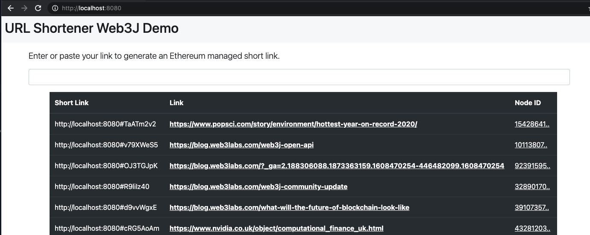

# url-shortener-web3j

This is a adaptation of URL Shortener [URL Shortener](https://github.com/mohamedelshami/AKAP-url-shortener) to incorporate [web3j sdk](http://docs.web3j.io/quickstart/).

## Try

Start Ganache development network, and deploy AKAP.sol from AKAP [contracts](https://github.com/cfelde/AKAP/tree/master/contracts) directory:

    $ configure environment varaible in app.properties [development|demo] 

Start embedded server with gradle run task:

    $ ./gradlew -t run

Start your browser at:

    $ http://localhost:8080/

## Generating Contract Wrapper (Optional)

The web3j [contract](https://github.com/mohamedelshami/url-shortener-web3j/tree/main/src/jvmMain/java/io/epirus/generated/contracts) wrappers can be generated using the following command:

    $ epirus generate truffle generate —truffle-json URLShortener.json —outputDir src/main/java —package demo.urlshortener